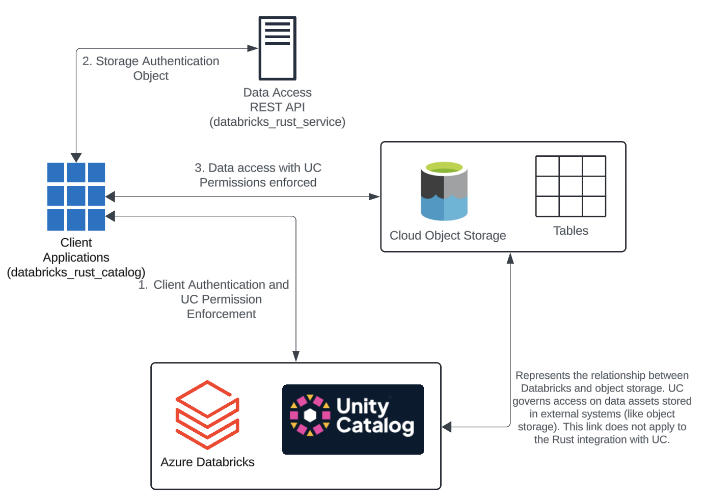

# Databricks - Rust - Integration

This repository is designed for running Rust workloads against Databricks datasets. It includes:

- Collection of data from the Databricks [REST API](https://docs.databricks.com/api/workspace/catalogs)
- Reading data directly from storage using the Unity Catalog APIs for metadata

The goal is to integrate Rust and Polars/Spark/Datafusion with Databricks datasets. Here is the high level workflow that occurs behind the scenes after the user authenticates and looks to read data using rust. 

**Note: This is not for production use!**

## Resources

- [Install and Learn Rust](https://www.rust-lang.org/learn)
- [The Rust Programming Language Book](https://doc.rust-lang.org/book/)
- VS Code Extension: [rust-analyzer](https://rust-analyzer.github.io/)
- Generate Documentation: `cargo doc --open --no-deps --target-dir=./docs`
- [Integration Tests](https://doc.rust-lang.org/book/ch11-03-test-organization.html) and [Test Selection](https://doc.rust-lang.org/cargo/commands/cargo-test.html)
- [Twilio Blog on Building High-Performance REST APIs with Rust and Axum](https://www.twilio.com/en-us/blog/build-high-performance-rest-apis-rust-axum)

